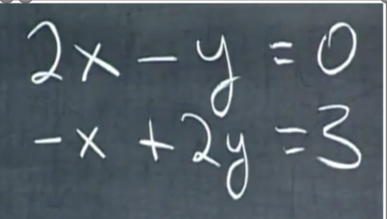
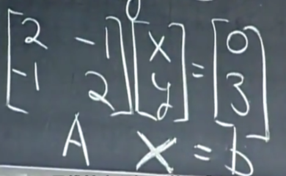
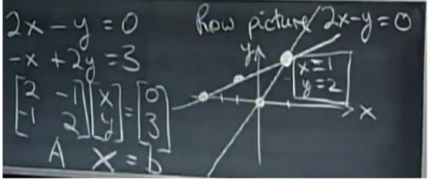
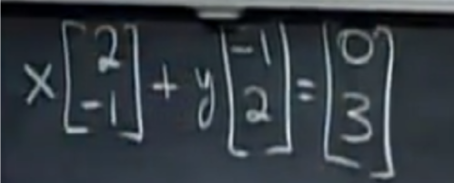
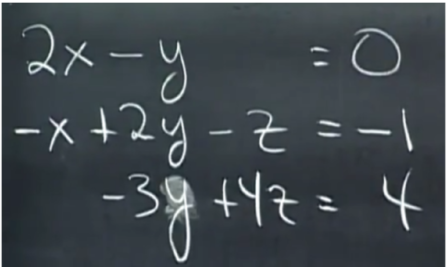
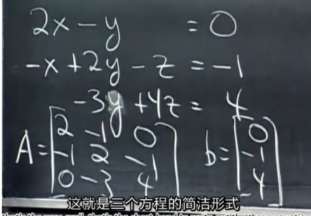
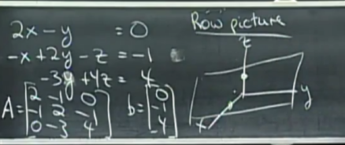
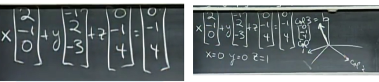
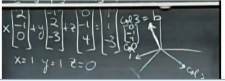

# n线性方程组，n个方程n个位置变量(n linear equations n unknowns)

## 名词

0. row picture，行图像
1. column picture 列图像
2. Matrix 矩阵
3. linear equation之中linear就是直线的意思
4. linear combination of columns，贯穿课程的基本方法
5. elimination， 消元法
6. non-singular matrix非奇异矩阵。invertible matrix 可逆矩阵，we like best

## 例子a

* 
* 矩阵形式
  * 
  
  * row picture: 
    * 是否经过原点非常重要(上排经过，下排木有)
  * columns picture: 
    * 列图像，目的是如何将`第一个向量`，和`第二个向量`，做`线性组合`(`4`)，从而构成第三个`向量`

## tip a

* 选取`所有的x`,`所有的y`和`所有的组合`，会发生什么 could get any right-hand side at all，得到任何右侧的组合, 两个向量的组合会`布满整个坐标平面`

## 例子b

* 3x3: 
* matrix: 
* row picture: 
  * 3x3问题的每一row(行)都是三维空间中的一个平面，Each row in a three by three problem gives us a plane in three dimensions
    * (想象一个变量为0， 另两个变量组成一条直线，然后这个为0的变量如果可以取非直线上的值，就会形成平面)
  * 三维空间中的`两个方程，确定一条直线`(`两个平面确定一条线`)
  * 三个平面不`特殊`也不`平行`，则必定交于一点
* column picture: 
  * 换右: 
  * big picture keep this same matrix on the left， but imagine that we have a different right-hand side
  * 这次right-hand换成了1,1,-3，也是一个特殊向量，是前两列的和, 新的解也很显然
  * 问题a: Can I Solve `Ax = b` for every `b`
    * 现在考虑所有的right-hand sides，所有的b 等价于代数问题，对任意b，是否能求解Ax=b 如果有，消元法（`5`）就能求出来
  * 问题b: do the linear combinations of the columns fill three dimensional space, 每个b，就是整个三维空间中的所有b
  * a和b, 两种问法的意义一样
  * Ax中A是`6`，最喜欢， 如果不是6，就说明三列向量可能`处于同一个平面`, 则组合也一定处于平面内，没办法铺满整个空间，则`6`的相反
    * 想象一个9维的 we have vectors with nine components, 有9column，每个column都是九维空间的向量, 比如取随机矩阵，永远是有解的，这里特指matlab中的随即命令command, 任取一个9x9矩阵如果选取一些相互不独立的列向量columns they're not independent, 9 column 只相当于8 column有一列向量毫无贡献contributes nothing new，有一些b就无法求得, 那这些column只能覆盖一个九维里的一个大致上可能或许的一个8维平面
    
* tips: Ax is a comb of columns, Ax是A列的线性组合
  * 
